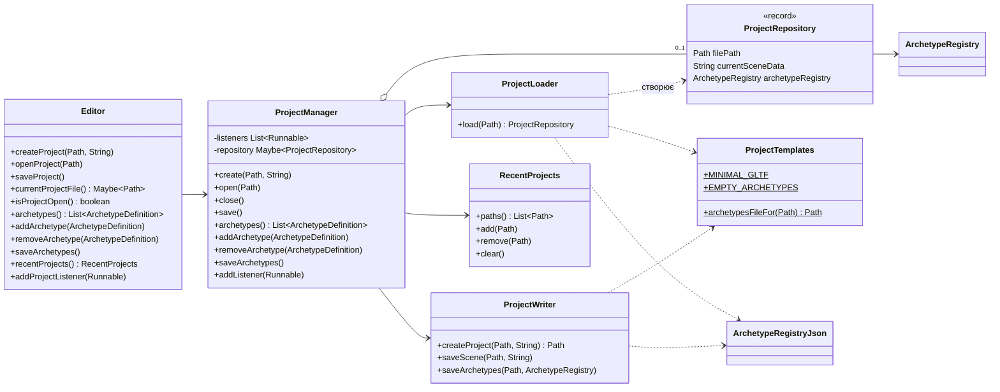
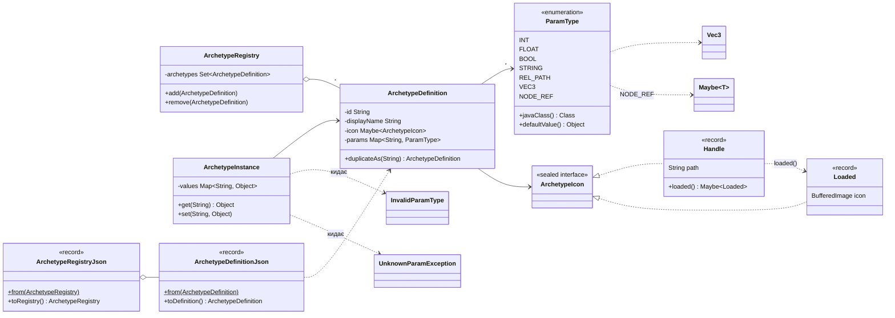
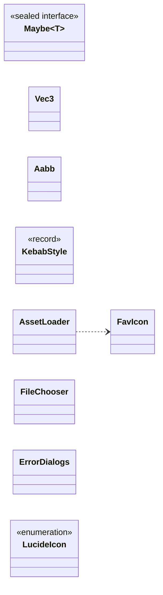
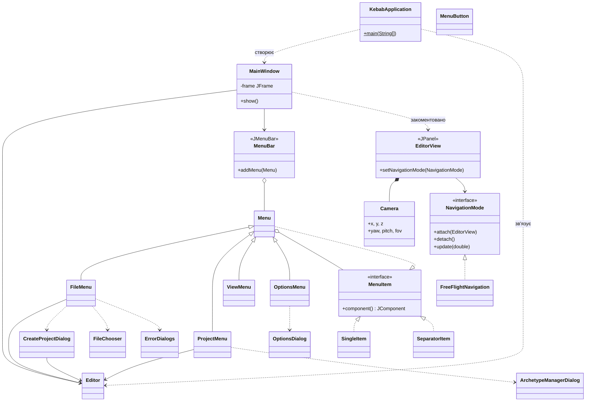
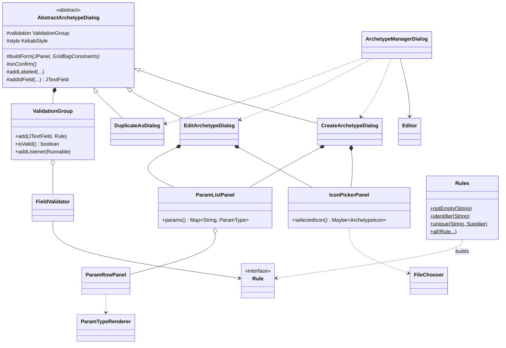
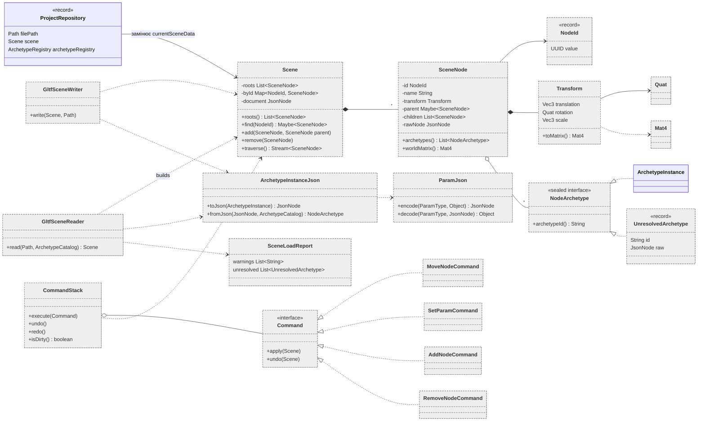
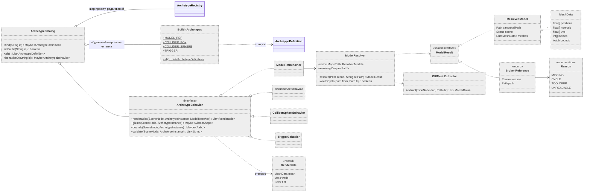
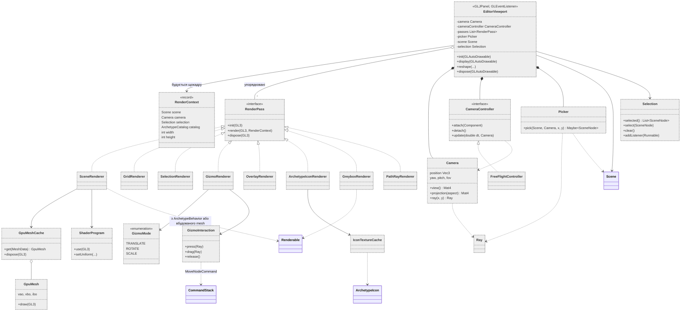
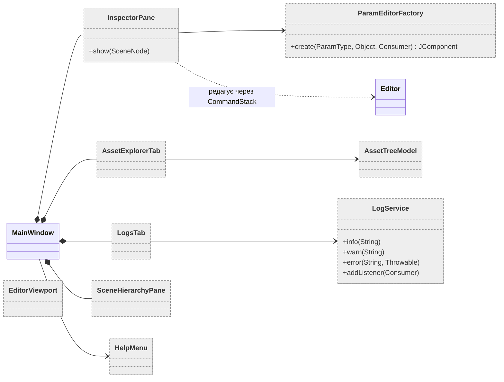
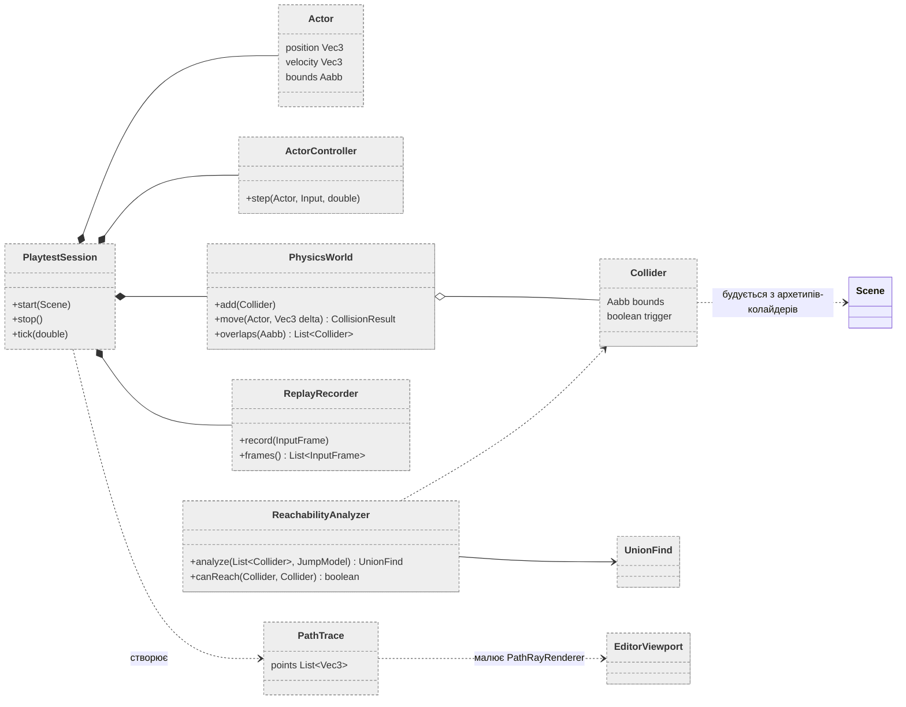

# C4 · Рівень 4 (Код)

Сірі пунктирні класи — заплановані, решта є в коді.

## 1. Project



## 2. Archetype



## 3. Common (утиліти, math)



## 4. UI: вікно, меню, навігація



## 5. UI: діалоги архетипів і валідація



## 6. Scene: модель і glTF I/O (заплановано)



```json
"extras": { "kebab": { "id": "7f3a...", "archetypes": [
  { "id": "model_ref", "params": { "path": "Models/tree.gltf" } },
  { "id": "collider_box", "params": { "size": [1, 2, 1], "offset": [0, 1, 0] } }
] } }
```

## 7. Вбудовані архетипи та model_ref (заплановано)



## 8. Rendering: JOGL (заплановано)



## 9. Editor panes (заплановано)



## 10. Playtest і аналіз (заплановано)



